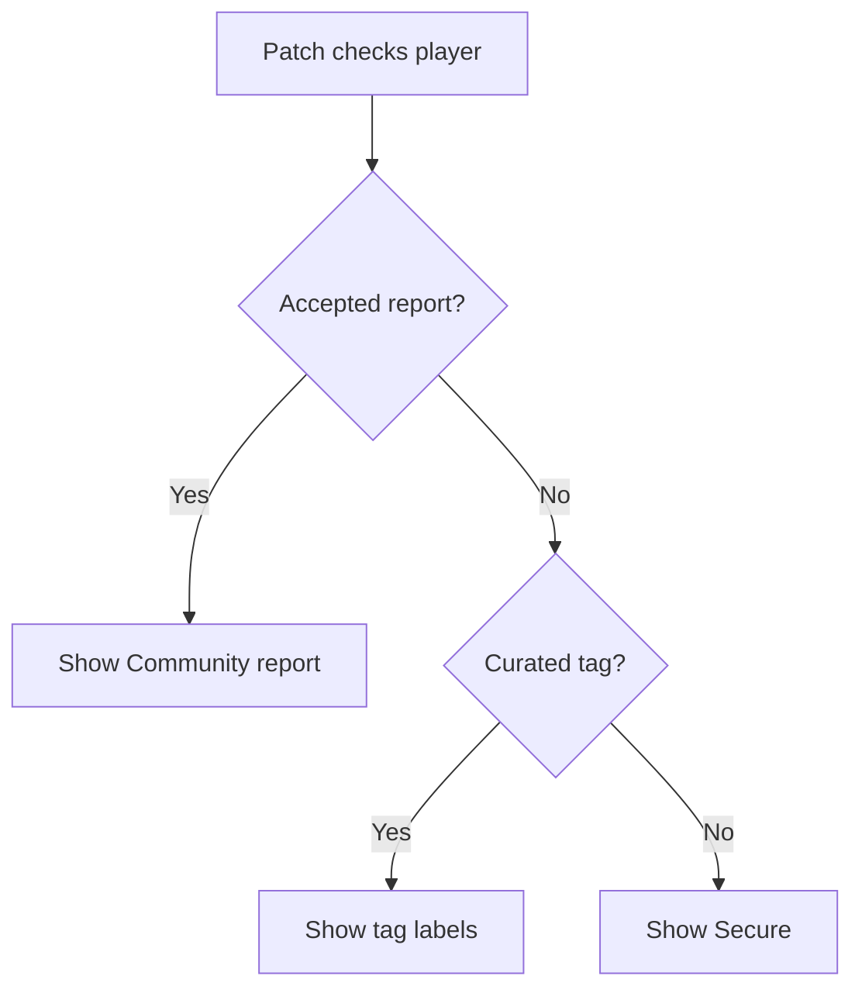

# Profile status

Patch adds small public labels so people can understand a player card quickly. Tiny labels, useful context.

[!badge Secure|success] [!badge Community report|danger] [!badge Verified|warning] [!badge Creator|question]

## Status order

+++ No accepted report
Patch can show curated tags such as `Verified`, `Developer`, `Creator`, `Competitive`, or `Organizer`.

If there are no curated tags, Patch shows `Secure`.
+++ Accepted report
An accepted community report takes priority over curated tags.

That means `/stats` and `/profile` show `Community report` with the staff-approved public reason.
+++ In-game ban
If public player data says an account has an active in-game ban, the profile card can show a banned identity marker too.
+++

## What each label means

| Label            | Tiny explanation                                                     | Where it appears     |
| ---------------- | -------------------------------------------------------------------- | -------------------- |
| Secure           | Patch has no accepted community report or curated tag for the player | `/stats`, `/profile` |
| Community report | Staff accepted a proof-backed report                                 | `/stats`, `/profile` |
| Verified         | Known and trusted by the Patch team                                  | `/stats`, `/profile` |
| Developer        | Critical Ops developer                                               | `/stats`, `/profile` |
| Creator          | Content creator                                                      | `/stats`, `/profile` |
| Competitive      | Competitive player                                                   | `/stats`, `/profile` |
| Organizer        | Hosts official tournaments or events                                 | `/stats`, `/profile` |

!!!question Can I get a tag?
Maybe. Join the support server, open a ticket, and bring context. Patch likes clean receipts.
!!!

## Status flow

