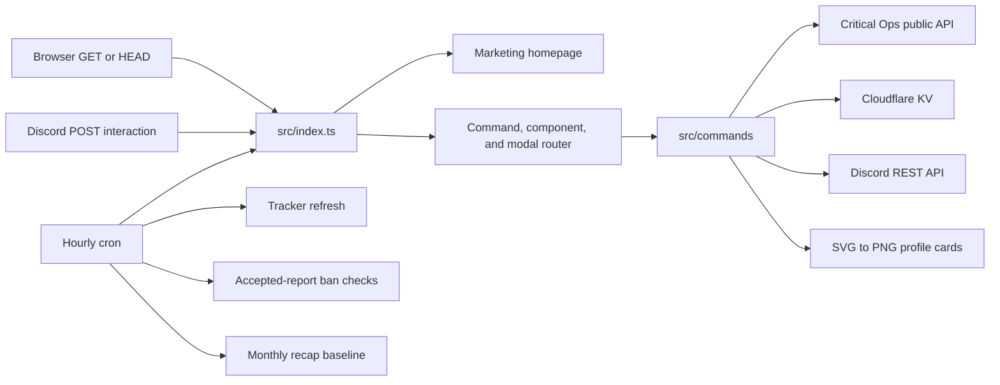

# Patch architecture

Patch is a single Cloudflare Worker with two public faces: a small website for normal browser requests and a Discord Interactions endpoint for the bot. The same Worker also runs an hourly scheduled job. Critical Ops player data comes from the public Critical Ops profile API; persistent bot state lives in the `USER_PREFERENCES` KV namespace.



## Request flow

`src/index.ts` is the Worker entry point. `GET` and `HEAD` requests go to `marketingHomepage`, which serves the homepage plus its CSS, JavaScript, image, favicon, robots, sitemap, and 404 routes; other non-POST methods receive a 405 response. A Discord `POST` supplies the raw interaction body plus Ed25519 signature headers. The Worker verifies those with `DISCORD_PUBLIC_KEY` before parsing or routing the interaction.

Discord sends several interaction types. A ping receives the required pong immediately. An application command is matched by name in `COMMANDS`; `/cops` is retained as an alias for `/stats`. A message component is routed from its custom ID to the profile, stats, tracking, help, or staff report-review handler. A modal submission is routed to compare, report, tracking, or staff review. New Components V2 IDs follow `patch:v2:<scope>:<action>:<args>`; `components-v2.ts` creates and parses them. A few older `stats_page:*` and `report_*` IDs remain supported explicitly in `index.ts`.

Commands that may take longer acknowledge Discord with a deferred response, continue through `ctx.waitUntil`, then edit the original interaction webhook. `discord.ts` owns those response types, webhook edits, multipart uploads, DMs, and normal channel messages. After a user's first public command, `onboarding.ts` may also schedule a one-time welcome DM.

The command path is therefore:

```text
signed POST -> src/index.ts -> commands/index.ts -> one command module
            -> cops/storage/UI/card helpers -> Discord response or webhook edit
```

## Scheduled flow

The cron configured in `wrangler.jsonc` runs at the start of every hour. `src/index.ts` attaches each job with `ctx.waitUntil`:

1. `warmPlayerCardRenderer` initializes Resvg so a later profile-card render has less setup work.
2. `runScheduledRankedUpdates` loads tracker records, skips records refreshed within six hours, and refreshes at most 20 tracker records with at most 10 players per record in one run.
3. `runBanWatcher` checks accepted reports for a newly visible Critical Ops ban. It rechecks a record no more often than every six hours and checks at most 20 reports per run. A confirmed ban updates stored report state and DMs the reporter when bot credentials are present.
4. `refreshStaffReviewAnalytics` is called, but its recovered implementation is currently empty.
5. `updateMonthlyCommunityRecapBaseline` creates and stores the previous month's recap on the first UTC day of a month if one does not already exist.

Tracker refreshes update the latest snapshot but leave the baseline intact. When a user opens or refreshes `/track`, the UI calculates changes from baseline to latest, displays them, then accepts the latest snapshots as the new baseline.

## Module map

### Entry point and commands

| File                      | Responsibility                                                                                                                                                                                     |
| ------------------------- | -------------------------------------------------------------------------------------------------------------------------------------------------------------------------------------------------- |
| `src/index.ts`            | Cloudflare `fetch` and `scheduled` handlers, Discord signature verification, and top-level interaction routing.                                                                                    |
| `src/commands/index.ts`   | Collects runtime command handlers and produces the Discord registration definitions, adding the optional private-response setting where supported.                                                 |
| `src/commands/help.ts`    | Builds the interactive help dashboard and changes its selected help section.                                                                                                                       |
| `src/commands/stats.ts`   | Looks up a player, builds overview/season/all-time output and the Components V2 stats dashboard, and handles view, profile, compare, track, and report controls.                                   |
| `src/commands/profile.ts` | Looks up a player, records the lookup, renders or retrieves a PNG profile card, and handles refresh, view, stats, compare, tracking, and report actions.                                           |
| `src/commands/compare.ts` | Fetches two players concurrently and builds a current-season comparison using rank, MMR, K/D, KDA, win rate, kills per match, and activity context.                                                |
| `src/commands/track.ts`   | Owns the per-user tracking dashboard, add/remove/refresh/public controls, and the add-player modal. Tracking replies are private by default.                                                       |
| `src/commands/report.ts`  | Validates proof, creates short-lived report drafts, submits reports to the staff channel, handles staff accept/reject modals, stores outcomes, clears affected card caches, and sends receipt DMs. |
| `src/commands/dev.ts`     | Restricts developer tools by configured Discord user IDs and supports accepted-report cleanup, player-tag changes, report access pauses, and manual community-recap posting.                       |

### Library modules

| File                               | Responsibility                                                                                                                                                                                                 |
| ---------------------------------- | -------------------------------------------------------------------------------------------------------------------------------------------------------------------------------------------------------------- |
| `src/lib/cops.ts`                  | The Critical Ops API client and the domain rules for names, IDs, seasons, stats, ranks, bans, activity timestamps, and display formatting. Public profile responses are held in a short-lived in-memory cache. |
| `src/lib/discord.ts`               | Discord protocol constants and low-level helpers for interaction responses, options, components, modals, background work, webhook edits, file uploads, channel messages, and DMs.                              |
| `src/lib/components-v2.ts`         | Small builders for Discord Components V2 containers, text, separators, media, rows, buttons, menus, custom IDs, dashboards, and empty states.                                                                  |
| `src/lib/app-ui.ts`                | High-level Patch screens: profile and stats views, comparisons, tracking, help, report receipts, community recaps, developer results, and consistent errors.                                                   |
| `src/lib/presentation.ts`          | Formatting helpers and image references used by the older embed-based pages, including the legacy stats page selector.                                                                                         |
| `src/lib/card-image.ts`            | Builds the player-card SVG, initializes `@resvg/resvg-wasm`, embeds fonts and rank art, and renders the final PNG bytes.                                                                                       |
| `src/lib/profile-card-cache.ts`    | Caches rendered cards in bounded process memory, `caches.default`, and optionally KV. Lookup keys live for 30 minutes and content-fingerprint keys for 60 minutes.                                             |
| `src/lib/profile-card-response.ts` | Packages a card as a Discord attachment and edits the deferred interaction response with a multipart upload.                                                                                                   |
| `src/lib/storage.ts`               | Centralizes KV key construction, normalization, and persistence for trackers, reports, tags, lookup counts, onboarding, cooldowns, reputation, and recaps. It also creates tracker snapshots and deltas.       |
| `src/lib/tracking.ts`              | Adds/toggles players, refreshes Critical Ops snapshots, computes movement from baseline to latest, formats change lines, and performs bounded cron refreshes.                                                  |
| `src/lib/ban-watcher.ts`           | Rechecks accepted reports against current ban data, marks confirmed reports, updates accepted-report metadata, and sends decision/ban DMs.                                                                     |
| `src/lib/reporting.ts`             | Builds and stores monthly community recap totals and can post a recap to the support report channel. `refreshStaffReviewAnalytics` is currently a no-op.                                                       |
| `src/lib/player-tags.ts`           | Defines and normalizes the six curated tags and resolves the public status shown for an accepted report, tagged player, or otherwise secure player.                                                            |
| `src/lib/lookup-counts.ts`         | Increments a player's persistent profile-view counter directly or through `waitUntil`.                                                                                                                         |
| `src/lib/onboarding.ts`            | Detects a user's first supported command, stores that fact, and sends one welcome DM in the background.                                                                                                        |
| `src/lib/homepage.ts`              | Routes website `GET`/`HEAD` paths and returns HTML, CSS, browser JavaScript, binary art, favicon, robots, sitemap, or a 404 with cache and security headers appropriate to each response.                      |
| `src/lib/brand.ts`                 | Supplies the recovered support URL/label and developer credit used across bot responses.                                                                                                                       |

### Website modules

| File                      | Responsibility                                                                                                                                                                        |
| ------------------------- | ------------------------------------------------------------------------------------------------------------------------------------------------------------------------------------- |
| `src/site/template.ts`    | The semantic Patch marketing page, factual bot copy, command explorer, social metadata, 404, and sitemap output.                                                                      |
| `src/site/site.css`       | Pijon-inspired light/dark design tokens, glass navigation, ribbon hero, responsive sections, component previews, focus states, and reduced-motion behavior.                           |
| `src/site/site.client.js` | Persisted theme selection, mobile navigation, command tabs, reveal enhancement, and footer year. It is imported as text and served with a strict same-origin Content Security Policy. |
| `src/site/urls.ts`        | HTTPS validation and fallbacks for the Discord install, support, documentation, and canonical URLs.                                                                                   |
| `src/site/assets.ts`      | Maps the recovered Critical Ops and rank art to independently cacheable website routes.                                                                                               |

`src/types.ts` contains the recovered TypeScript shapes for the Worker environment and Discord payloads. `src/assets.d.ts` tells TypeScript how imported binary and text assets should be typed. Files under `src/assets` remain bundled into the Worker for the website and profile-card renderer, but the website now serves them as separate cacheable responses rather than embedding every image into the HTML.

## Persistent data

All application records use one KV binding, `USER_PREFERENCES`. The prefix is the practical schema: changing it creates a new logical collection, while changing a record shape requires the corresponding normalizer in `storage.ts` to remain backward-compatible.

| KV key                                | Stored record and lifecycle                                                                                                                                                                                                                                                                              |
| ------------------------------------- | -------------------------------------------------------------------------------------------------------------------------------------------------------------------------------------------------------------------------------------------------------------------------------------------------------- |
| `track:<discord-user-id>`             | A tracker record with the owner ID, up to 25 tracked players, and record-level refresh/view times. Each player keeps its lookup, identity, latest snapshot, baseline snapshot, and add/refresh/view times. A snapshot contains season, kills, deaths, MMR, rank, peak rank, last-online time, and level. |
| `report:draft:<report-id>`            | A report draft containing reporter, player lookup, and proof. It expires after 15 minutes and connects the slash command to its reason/details modal.                                                                                                                                                    |
| `report:pending:<report-id>`          | The full review record. It starts as `pending` and remains as the audit record when it becomes `accepted`, `rejected`, or `ban_confirmed`, with review and ban timestamps added as those events occur.                                                                                                   |
| `report:accepted:<player-id>`         | The current accepted public report for one player, including reporter/reviewer data and later ban-watcher metadata. Further reports for that player can be recorded as duplicates on this record.                                                                                                        |
| `report:blacklist:<discord-user-id>`  | A staff-created pause on that user's ability to submit reports, with creator, reason, and creation time.                                                                                                                                                                                                 |
| `report:cooldown:<discord-user-id>`   | A ten-minute submission cooldown containing `retryAt`; the KV entry uses the same expiry.                                                                                                                                                                                                                |
| `report:reputation:<discord-user-id>` | Submitted, accepted, rejected, and ban-confirmed counts plus last-event times and the derived reporter tier.                                                                                                                                                                                             |
| `player:tags:<player-id>`             | Curated player tag IDs plus player name, updater, and update time. Valid IDs are `verified`, `partner`, `developer`, `creator`, `competitive`, and `organizer`.                                                                                                                                          |
| `player:lookup-count:<player-id>`     | Player ID/name, cumulative lookup count, and update time.                                                                                                                                                                                                                                                |
| `onboarding:<discord-user-id>`        | The first supported command and onboarding start time; its existence prevents another welcome DM.                                                                                                                                                                                                        |
| `community:recap:<YYYY-MM>`           | A generated monthly summary: reports reviewed/accepted/declined, confirmed bans, and the top five positive tracked MMR movements.                                                                                                                                                                        |
| `card-cache:<hashed-key>`             | PNG card bytes for a lookup or content fingerprint. KV is one layer of the profile-card cache and entries expire after 30 or 60 minutes.                                                                                                                                                                 |

KV provides persistent, eventually consistent storage. The in-process maps in `cops.ts` and `profile-card-cache.ts` are only warm-isolate caches and may disappear whenever Cloudflare starts a new Worker isolate. `caches.default` is the regional edge-cache layer for PNG cards; KV is the durable fallback when configured.

## Recommended reading order

Start with `src/index.ts`; it shows every way execution enters the bot. Next read `src/commands/index.ts` and one simple command such as `help.ts`, then follow `stats.ts` for a representative player lookup. Read `cops.ts` next, because most future player features should reuse its parsing and formatting instead of decoding the Critical Ops response again.

After that, read `components-v2.ts` before `app-ui.ts`: the former is the low-level Discord vocabulary, while the latter composes it into Patch screens. For persistent features, read `storage.ts` before `tracking.ts` or `report.ts`; storage defines the records those workflows mutate. Finish the profile-card path with `profile.ts` -> `profile-card-cache.ts` -> `card-image.ts` -> `profile-card-response.ts`, and the background path with `index.ts` -> `tracking.ts`, `ban-watcher.ts`, and `reporting.ts`.

When adding a slash command, follow the existing `{ definition, handle }` shape, export it from its command file, and add it to `commands/index.ts`. When adding a button or menu, generate its ID with `customId`, add the UI in `app-ui.ts` (or the owning command), and route its scope/action from `index.ts` or the existing scoped handler. When adding persistent data, put all key and normalization logic in `storage.ts` so commands do not invent KV formats independently. For homepage work, edit content in `site/template.ts`, presentation in `site/site.css`, and only browser behavior in `site/site.client.js`; keep URL validation in `site/urls.ts`.
