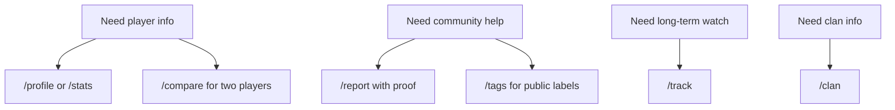

# Commands

Patch has public tools for players and community tools for reports, tags, and clans. The short version: ask Patch, get the useful bit, move on with your day.

||| Player tools
[!card compact](player-tools.md)
||| Community tools
[!card compact](community-tools.md)
||| Status tags
[!card compact](../features/profile-status.md)
|||

## Command shelf

| Command | Use it when | Patch gives you |
| --- | --- | --- |
| `/help` | You want the menu | Command list, support link, ping, uptime |
| `/stats player:<name-or-id>` | You want details | Overview, current season, all-time public totals |
| `/profile player:<name-or-id>` | You want a shareable card | PNG profile card |
| `/compare player1:<name-or-id> player2:<name-or-id>` | You want a side-by-side read | Ranked matchup summary |
| `/clan query:<name-or-tag>` | You want a clan snapshot | Leaderboard and performance pages |
| `/track player:<name-or-id>` | You want weekly changes | Private DM recap each Sunday |
| `/tags` | You want label meanings | Secure, report, and curated tag guide |
| `/report player:<name-or-id> proof:<image-or-video>` | You have proof | Staff review form |

!!!warning Public data note
Patch reads public Critical Ops data. If the public board cannot find a player or clan, Patch cannot magically pull it from under the sofa.
!!!

## Tiny map

