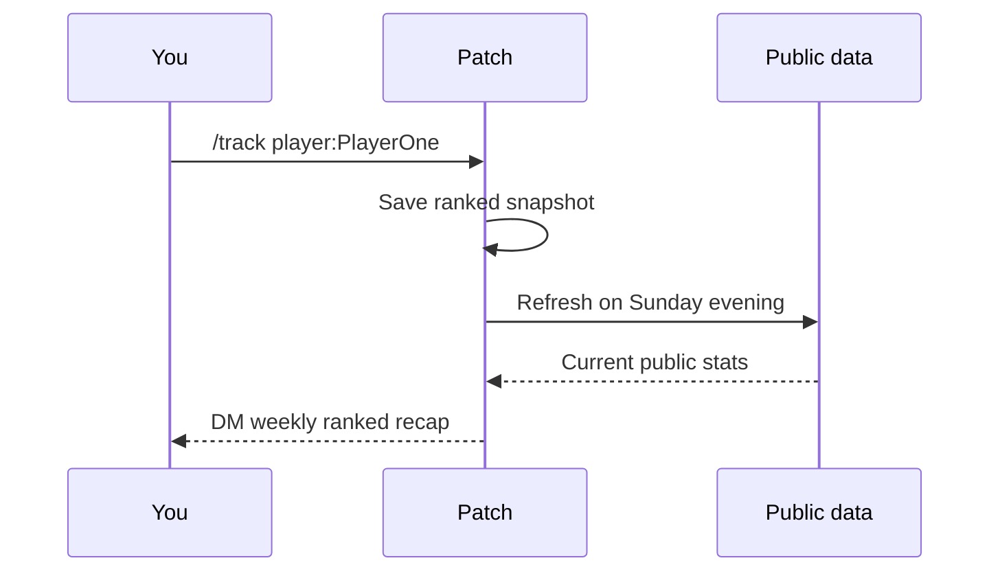

# Weekly tracking

`/track` is for "tell me what changed later" moments.

Use:

```text
/track player:<name-or-id>
```

Patch saves a snapshot, then sends you a private ranked recap every Sunday at 18:00 Europe/Brussels.

## What the recap tracks

| Field | What Patch compares |
| --- | --- |
| Kills | New total minus old total |
| Deaths | New total minus old total |
| Rating/MMR | New value minus old value |
| Rank | Whether the rank name changed |
| Level | New level minus old level |

## Watchlist rules

[!badge Max 25 players|info] [!badge Ranked focus|success] [!badge Private DM|primary]

- Your watchlist belongs to your Discord user.
- Patch sends the recap by DM.
- The weekly message includes a menu to remove tracked players.
- If you add the same player again, Patch refreshes the saved snapshot.

## Recap day



!!!warning DMs must be open
If Discord will not let Patch DM you, the recap cannot land. Give Patch a clear little doorway.
!!!
