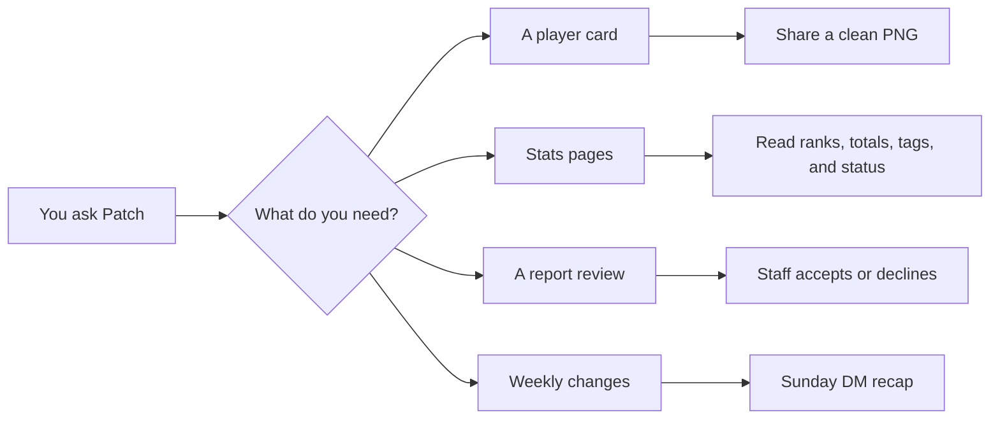

# Patch, explained gently

[!badge Discord bot|primary] [!badge Critical Ops|info] [!badge User guide|success]

Patch is the helpful scoreboard buddy for your Discord server. Give Patch a player, clan, report, or question, and it brings back a clean answer without making you dig through a messy drawer of numbers.

[!button text="Start with the tiny tour" icon="rocket" variant="primary"](getting-started.md)
[!button text="See every command" icon="terminal" variant="secondary"](commands/)
[!button text="Host these docs for free" icon="globe" variant="info"](hosting-github-pages.md)

!!!
Think of Patch like a little helper with neat pockets: one pocket for stats, one for profile cards, one for weekly tracking, and one for reports that need staff eyes.
!!!

||| Look up
Use `/stats`, `/profile`, `/compare`, and `/clan` when you want answers from public Critical Ops data.

[!card compact](commands/player-tools.md)
||| Keep watch
Use `/track` to save players and get a weekly DM recap of ranked changes.

[!card compact](features/weekly-tracking.md)
||| Help staff
Use `/report` when you have image or video proof and want staff to review it.

[!card compact](features/reports-and-staff.md)
|||

## The big picture

## Handy doors

[!card title="Getting Started" text="Install Patch in your server, try the first command, and learn the easy habits." image="static/patch-card-preview.svg"](getting-started.md)
[!card title="Command Shelf" text="Every user command, when to use it, and what Patch gives back." image="static/patch-card-preview.svg"](commands/)
[!card title="Profile Status" text="Secure, community reports, and curated tags explained without mystery fog." image="static/patch-card-preview.svg"](features/profile-status.md)
[!card title="FAQ" text="Short answers for common little bumps." image="static/patch-card-preview.svg"](faq.md)
